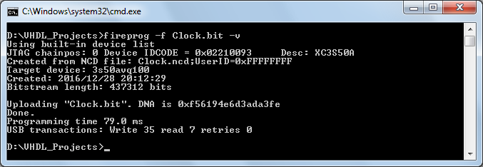
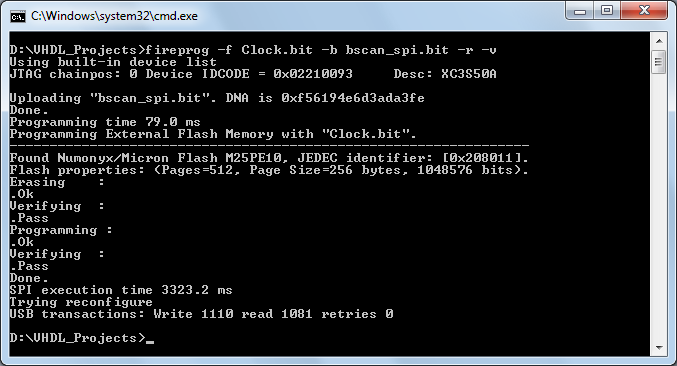

# fireprog: a Xilinx Spartan 3 configuration software
Fireprog is a utility which can program Xilinx Spartan 3 FPGAs via FT232H-based USB-to-JTAG adapter.
It is based on fpgaprog and Papilio-Prog, to which support for Micron M25PE10 SPI flash was added.
Fireprog is used to configure Prometheus FPGA boards.

Copyleft (C) Altynbek Isabekov, Onurhan Öztürk

License:  GNU General Public License v2

## Compilation on Linux

To compile on Linux, install *libusb* and *libftdi* first and then run *make*:

	sudo pacman -S libusb libftdi
	make clean
	make

The resulting ELF binary "fireprog" will be linked with libusb and libftdi.

## Cross-compilation on Linux for Windows

In order to cross-compile on Linux for Windows, firstly install MinGW-w64 cross-compiler:

    sudo pacman -S mingw-w64-gcc mingw-w64-headers mingw-w64-binutils mingw-w64-winpthreads mingw-w64-crt

Then download the x64 version of the "CDM v2.12.24 WHQL Certified.zip" driver
from http://www.ftdichip.com/Drivers/D2XX.htm and unzip it into "libftd2xx" folder, which is at the same hierarchy level as "fireprog".

	├── fireprog
	│   ├── bitfile.cpp
	│   ├── bitfile.h
	│   │...
	│   ├── tools.cpp
	│   └── tools.h
	│
	├── libftd2xx
	│   ├── amd64
	│   ├── ftd2xx.h
	│   ├── ftdibus.cat
	│   ├── ftdibus.inf
	│   ├── ftdiport.cat
	│   ├── ftdiport.inf
	│   ├── i386
	└── └── Static

The linker will use "../libftd2xx" folder (see the Make files). Modify the Make files to change the cross-compiler location (default is /usr/bin/i686-w64-mingw32-*).

After unzipping the libftd2xx driver, you can cross-compile on Linux for Windows (yields "fireprog.exe", which is a PE32 or PE32+ executable).
Depending on the architecture and linking type, one of the following commands should be executed:

	make -f Makefile.MinGW32Static clean
	make -f Makefile.MinGW32Static

	make -f Makefile.MinGW32Dynamic clean
	make -f Makefile.MinGW32Dynamic

	make -f Makefile.MinGW64Static clean
	make -f Makefile.MinGW64Static

	make -f Makefile.MinGW64Dynamic clean
	make -f Makefile.MinGW64Dynamic

Dynamically linked executables require some libraries from the MinGW cross-compiler. Putting these libraries in the same folder where "fireprog.exe" resides, allows execution without errors:

	fireprog-win32-dynamic
	├── fireprog.exe
	├── libgcc_s_sjlj-1.dll
	├── libstdc++-6.dll
	└── libwinpthread-1.dll

	fireprog-win64-dynamic
	├── fireprog.exe
	├── libgcc_s_seh-1.dll
	├── libstdc++-6.dll
	└── libwinpthread-1.dll

## Cross-compilation on Linux for MacOS
Install OSXCross toolchain from source to an easily accessable directory (e.g. "/opt"):

    # Make the directory readable and writable to the user first
    sudo chown -R $(whoami):users /opt
    sudo chmod 755 $(whoami):users /opt
    cd /opt
    git clone https://github.com/tpoechtrager/osxcross

Pack the SDK on MacOS on a real Apple computer and put the packed achive "MacOSX10.11.sdk.tar.xz" to "/opt/osxcross/tarballs".
In this example, the MacOS cross-compiler is built for **OS X 10.11 El Capitan**, *Darwin version 15*.
Check compatibility between SDK versions and corresdponding targets in:

    /opt/osxcross/tools/osxcross-macports

If *clang* compiler is already installed, there is no need to build it. If not, then proceed as described in 

    /opt/osxcross/README.md

To build the cross toolchain (using *clang*), run:

    cd /opt/osxcross
    ./build.sh

Then build GCC:

    ./build_gcc.sh

Add OSXCross binary directory to the $PATH environment variable:

    export PATH=$PATH:/opt/osxcross/target/bin

Check the cross-compiler:

    x86_64-apple-darwin15-gcc -v
      Using built-in specs.
      COLLECT_GCC=x86_64-apple-darwin15-gcc
      COLLECT_LTO_WRAPPER=/opt/osxcross/target/bin/../libexec/gcc/x86_64-apple-darwin15/9.2.0/lto-wrapper
      Target: x86_64-apple-darwin15
      Configured with: ../configure --target=x86_64-apple-darwin15 --with-sysroot=/opt/osxcross/target/bin/../SDK/MacOSX10.11.sdk --disable-nls --enable-languages=c,c++,objc,obj-c++ --without-headers --enable-lto --enable-checking=release --disable-libstdcxx-pch --prefix=/opt/osxcross/target/bin/.. --with-system-zlib --with-ld=/opt/osxcross/target/bin/../bin/x86_64-apple-darwin15-ld --with-as=/opt/osxcross/target/bin/../bin/x86_64-apple-darwin15-as --with-multilib-list=m32,m64 --enable-multilib
      Thread model: posix
      gcc version 9.2.0 (GCC)

Once the toolchain is ready, download and unpack FTD2XX drivers for MacOS:

    cd <path of the "fireprog" repository>
    # Change one directory up (important!)
    cd ..
    mkdir libftd2xx
    cd libftd2xx
    wget -vc https://www.ftdichip.com/Drivers/D2XX/MacOSX/D2XX1.4.16.dmg
    # Unpack archive using p7zip
    7z x D2XX1.4.16.dmg release/D2XX
    mv release/D2XX .

Rename the shared library file by adding some prefix:

    mv D2XX/libftd2xx.1.4.16.dylib D2XX/backup_libftd2xx.1.4.16.dylib
    cd ..

This is needed to **enforce static linking**, so that static library *libftd2xx.a* instead of *libftd2xx.1.4.16.dylib* is used by the linker.

The hierarchy of the folders should look like this:

	├── fireprog
	│   ├── bitfile.cpp
	│   ├── bitfile.h
	│   │...
	│   ├── tools.cpp
	│   └── tools.h
	│
	├── libftd2xx
	│   ├── D2XX
	│   │   ├── ftd2xx.cfg
	│   │   ├── ftd2xx.h
	│   │   ├── backup_libftd2xx.1.4.16.dylib
	│   │   ├── libftd2xx.a
	│   │   ├── libusb
	│   │   ├── Object
	│   │   ├── Samples
	│   │   └── WinTypes.h
	└── └── D2XX1.4.16.dmg

The corresponding Makefile is written according to this directory structure.

Now compile the "fireprog":

    cd <path of the fireprog repository>
    make -f Makefile.MacOS

Check the output binary:

    file fireprog
      fireprog: Mach-O 64-bit x86_64 executable, flags:<NOUNDEFS|DYLDLINK|TWOLEVEL|WEAK_DEFINES|BINDS_TO_WEAK|PIE>

The output executable should be statically linked with no dynamic dependencies such as FT2XX:

    x86_64-apple-darwin15-otool -L fireprog
	fireprog:
		/usr/lib/libobjc.A.dylib (compatibility version 1.0.0, current version 228.0.0)
		/System/Library/Frameworks/IOKit.framework/Versions/A/IOKit (compatibility version 1.0.0, current version 275.0.0)
		/System/Library/Frameworks/CoreFoundation.framework/Versions/A/CoreFoundation (compatibility version 150.0.0, current version 1253.0.0)
		/usr/lib/libSystem.B.dylib (compatibility version 1.0.0, current version 1225.1.1)

## Usage

In order to program the Prometheus board, plug it in the USB port, Windows OS should recognize it as a USB-to-Serial (RS232) converter and associate it with the libftd2xx driver.
Now you can run "fireprog.exe" from the command line and supply the configuration bit-file.

Configuring FPGA with a bit-stream Circuit.bit:

    ./fireprog -v -f Circuit.bit

Configuring SPI Flash memory with a bit-stream Circuit.bit (mediator bscan_spi.bit is required):

    ./fireprog -v -f Circuit.bit -b bscan_spi.bit -r

The last switch "-r" triggers reconfiguration of the FPGA.

On Windows, command options are exactly the same:

